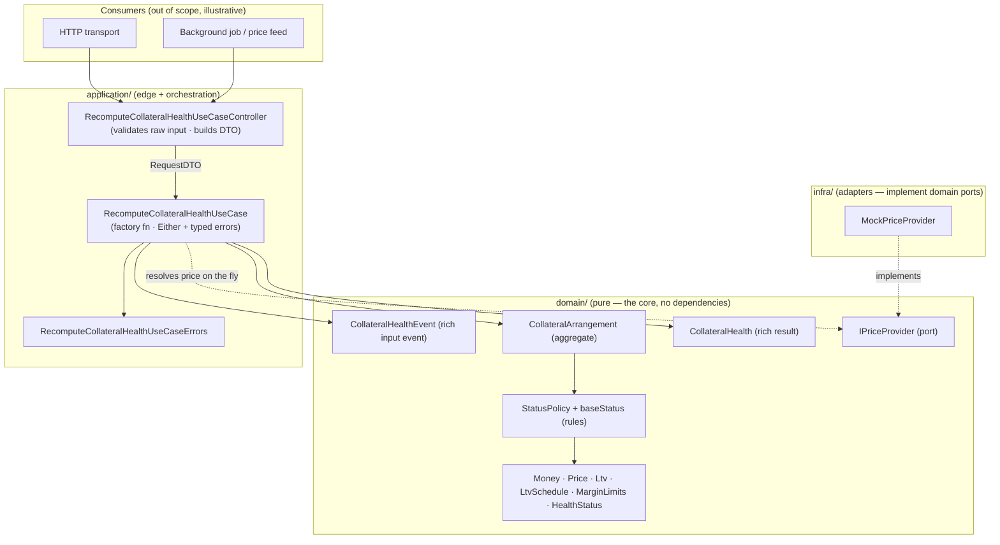
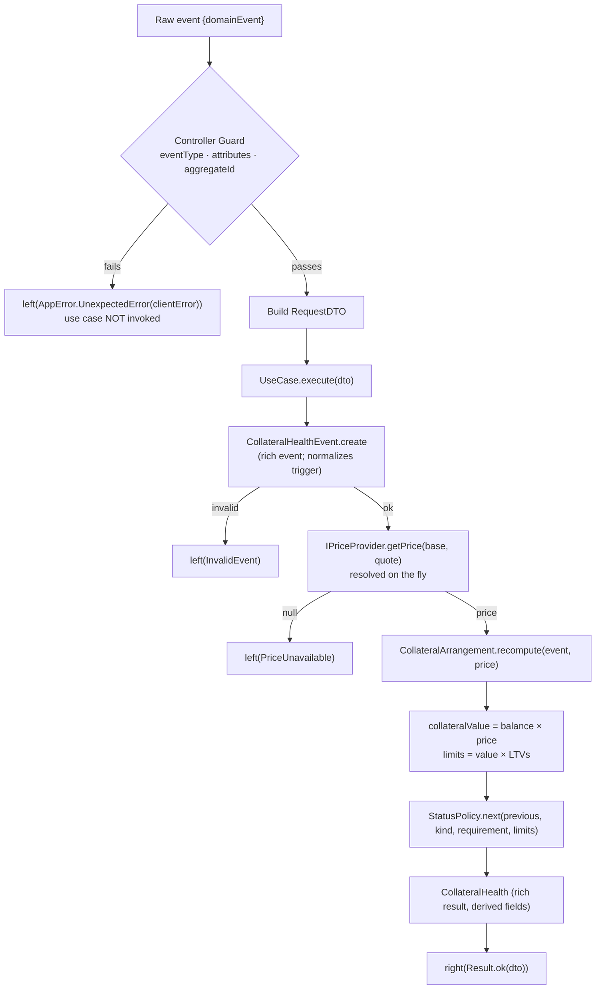
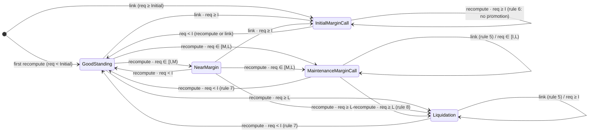

# Collateral Health

A small, well-modelled TypeScript library that computes the **health status** of a
**Collateral Arrangement** in response to an event (a loan being linked, a price move, a
balance change, a repayment). No UI, no HTTP, no persistence — just a clean domain that a
controller or a background job can drive trivially.

The emphasis is on **how the domain is modelled and tested**, not on how much is built: the
domain rules are pure functions, and the tests are the executable specification.

---

## 1. What this is

A Collateral Arrangement (CA) holds a **collateral balance** in one asset (e.g. `2 BTC`) and
backs a loan with a **requirement** in another (e.g. `USDC`). A **price** values the
collateral in the requirement's currency (`collateral value = balance × price`). Three
loan-to-value ratios (`Initial ≤ Maintenance ≤ Liquidation`) turn that value into three
monetary **limits**. The CA's **status** is decided by where the requirement falls relative
to those limits — plus history-dependent rules that also depend on the triggering event and
the previous status.

### How to run

```bash
yarn install
yarn test         # full suite (14 test files)
yarn test:coverage
yarn typecheck    # tsc --noEmit, strict
```

Requires Node.js 18+ and Yarn 1.x.

---

## 2. Why Onion + DDD + TDD

- **Onion / dependencies point inward.** The domain depends on nothing; the application
  layer depends on the domain; infrastructure implements domain ports. The same core can be
  driven by an HTTP transport *or* a queue consumer with no change.
- **DDD / rules live in the domain.** Every business rule is a pure function on rich value
  objects and entities. Invariants are enforced at construction (`static create → Result`),
  so malformed state is unrepresentable — the rules engine never sees bad input.
- **TDD / tests are the spec.** Every domain model owns a `*.test.ts`; the use case and the
  controller each own theirs. `StatusPolicy.test.ts` encodes all eight rules, every
  threshold boundary, the two documented ambiguities, and the worked example verbatim.

---

## 3. Architecture

### Layers



### Workflow — a raw event to a rich result



### State machine — the whole domain at a glance



### Folder layout

```
src/
  shared/                          # shared kernel
    core/    Result · Either · Guard · UseCase · UseCaseError · AppError · BaseController
    domain/  Entity · AggregateRoot · ValueObject · UniqueEntityID
  contexts/collateral/
    domain/                        # the pure core (each model owns a *.test.ts)
      Currency · Money · Price · Ltv · LtvSchedule · MarginLimits
      HealthStatus · CollateralHealthEvent · StatusPolicy
      CollateralArrangement · CollateralHealth · IPriceProvider
    application/recomputeCollateralHealth/
      RecomputeCollateralHealthUseCase(.test)
      RecomputeCollateralHealthUseCaseController(.test)
      RecomputeCollateralHealthUseCaseErrors
    infra/pricing/                 MockPriceProvider(.test)
    tests/                         CollateralArrangementMother · CollateralHealthEventMother
  index.ts                         # public API barrel
```

---

## 4. The domain rules

### The five statuses (by severity)

| # | Status | Meaning |
|---|--------|---------|
| 0 | **Good Standing** | Requirement comfortably below the initial limit. |
| 1 | **Near Margin** | Requirement in `[Initial, Maintenance)` on an ordinary recompute. |
| 2 | **Initial Margin Call** | Raised **only at link time** when `requirement ≥ Initial`. |
| 3 | **Maintenance Margin Call** | Requirement in `[Maintenance, Liquidation)`. |
| 4 | **Liquidation** | Requirement `≥ Liquidation`. |

### Base classification (pure, most-severe-first)

```
requirement ≥ Liquidation  → Liquidation
requirement ≥ Maintenance  → Maintenance Margin Call
requirement ≥ Initial      → Near Margin
otherwise (< Initial)      → Good Standing
```

Evaluating top-down means that when limits are *equal* the more severe status wins (the
precedence rule). The base classification **never** yields *Initial Margin Call* — that
status is reachable only through a link.

### Event- and history-dependent rules

- **(5) Link** yields only *Good Standing* or *Initial Margin Call*
  (`requirement ≥ Initial → Initial Margin Call`), regardless of which higher limit is
  crossed. A link must **not** override a preexisting *Maintenance Margin Call* or
  *Liquidation*.
- **(6)** *Initial Margin Call* cannot be promoted to *Maintenance* or *Liquidation*.
- **(7)** *Maintenance Margin Call* / *Liquidation* do not return to *Good Standing* until
  `requirement < Initial`.
- **(8)** *Maintenance Margin Call* can be promoted to *Liquidation*.

The unifying principle: an open call (Initial / Maintenance / Liquidation) never demotes to
a less-severe status — it cures only once `requirement < Initial`, otherwise it holds or,
where allowed, escalates.

### Worked example

`2 BTC` collateral, price `30 000 USDC/BTC` → **collateral value `60 000 USDC`**.
LTV schedule `50% / 65% / 80%` → limits **`30 000 / 39 000 / 48 000 USDC`**.
With a requirement of **`42 000 USDC`**:

| Trigger | Result |
|---|---|
| ordinary recompute (price move / balance / repayment) | **Maintenance Margin Call** (`42 000 ∈ [39 000, 48 000)`) |
| link | **Initial Margin Call** (`42 000 ≥ 30 000`) |

Both outcomes are asserted verbatim in the test suite.

---

## 5. Decisions log

| # | Decision | Rationale |
|---|----------|-----------|
| Q1 | On an ordinary recompute, an **Initial Margin Call stays IMC while `requirement ≥ Initial`** and cures to Good Standing only below Initial. | A margin call is an open obligation; reporting a less-severe "approaching" state while still at/above the initial limit would misrepresent it. Symmetric with rule 7. |
| Q2 | **Liquidation is sticky** — it holds until `requirement < Initial`, then cures straight to Good Standing; it does not step down to Maintenance. | Liquidation is the terminal operational state; a minor recovery shouldn't silently downgrade it. Band-wise de-escalation is a one-row change if the business prefers it. |
| Q3 | A healthy CA **can jump straight to Maintenance/Liquidation**, skipping IMC. | The base classification never yields IMC and no rule mandates gradual escalation; IMC is link-time only. |
| Q4 | **Strict `<` for "below", `≥` for "at or above".** Landing exactly on a limit belongs to the more-severe side. | Encoded as explicit boundary tests at each threshold. |
| Q5 | **The price is not part of the event** — the use case resolves it **on the fly** through the `IPriceProvider` port at compute time. | A price is a current observation, not a fact of the trigger; this keeps events small, stable and replayable, and makes a live feed a drop-in adapter. |
| Q6 | **Money is integer minor units (`bigint`), no floats**; limits compared at full precision. | Rounding only ever happens at the presentation edge. |
| Q7 | **Previous status travels in the request** (consumer-supplied); a CA has no status until its first event. | Persistence is out of scope; the aggregate models status as the last computed value. |
| Q8 | **`Initial ≤ Maintenance ≤ Liquidation` is an `LtvSchedule` invariant** (equality allowed). | Construction returns a failing `Result` otherwise; the precedence rule exists precisely for the equal case. |
| — | **`BaseController.clientError()` returns a value** instead of throwing, so validation failures come back on the `Either` left channel. | Consistent with "no exceptions cross the boundary"; keeps the controller transport-agnostic. |
| — | **Use cases are factory functions** `(deps) => { execute }`. | Dependencies injected as arguments; trivially unit-testable with a stubbed port. |
| — | **Rich event in, rich result out.** The input is a first-class `CollateralHealthEvent`; the output is a `CollateralHealth` entity that **derives** computed fields (`utilization`, `headroomToLiquidation`) at construction. | Consumers read everything from getters without re-deriving; malformed input fails at construction. |

These are the same architectural patterns you'll find in mature onion/DDD codebases,
described here as generic decisions rather than by any specific origin.

---

## 6. Execution plan & acceptance criteria

- [x] **Phase 0 — Scaffold.** `package.json`, strict `tsconfig`, `jest.config.ts`,
  `.gitignore`. `yarn test` and `yarn typecheck` run.
- [x] **Phase 1 — Shared kernel.** `Result` (+ test), `Either`, `Guard`, `UseCase`,
  `UseCaseError`, `AppError`, `BaseController`; `Entity`, `AggregateRoot`, `ValueObject`,
  `UniqueEntityID`. Zero context-specific imports.
- [x] **Phase 2 — Domain (TDD).** Every model owns a green test file. `StatusPolicy`
  covers all 8 rules, every boundary (`<` vs `≥`), Q1/Q2/Q3, and the worked example.
- [x] **Phase 3 — Application.** Factory-function use case (`Either` + typed errors),
  transport-agnostic controller (guard failure short-circuits without calling the use
  case), typed error namespace. Both tested.
- [x] **Phase 4 — Infra + test utilities.** `MockPriceProvider` (+ test); object mothers
  with worked-example defaults, used by the tests.
- [x] **Phase 5 — This README** (GitHub-renderable, Mermaid diagrams, decisions log).
- [x] **Phase 6 — Analysis doc** kept as the thinking deliverable, described in generic
  architectural terms.
- [x] **Phase 7 — Verify.** `yarn typecheck` clean; `yarn test` green (108 tests / 14
  files), including the worked-example assertions.

---

## 7. Out of scope (and what we'd do next)

- **Persistence / repositories** — health is computed from the event's figures; storage is
  a later port + adapter, invisible to the domain.
- **A real price feed** — a live market-data client is a drop-in implementation of
  `IPriceProvider`, with no change to the use case or domain.
- **A real HTTP transport** — wiring Express/Fastify or a queue consumer around the
  transport-agnostic controller is mechanical.
- **Domain events / audit trail** — a production system would emit `HealthRecomputed` /
  `MarginCallRaised` events; the aggregate is the natural emitter.
- **Time & price staleness** — no timestamps in the spec; production would carry an
  observation timestamp and a staleness policy.
- **Observability** — we keep the `try/catch → AppError.UnexpectedError` shape and leave
  structured wide-event logging as a drop-in.
```
