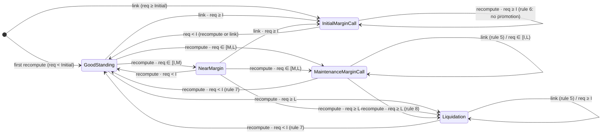
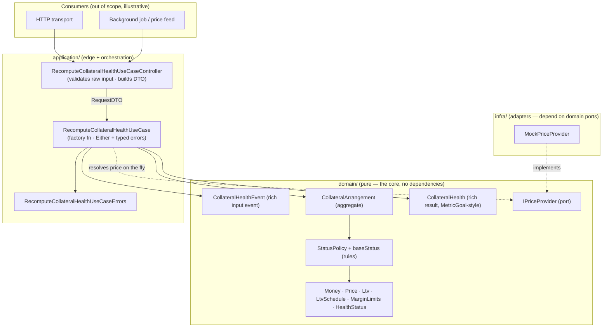
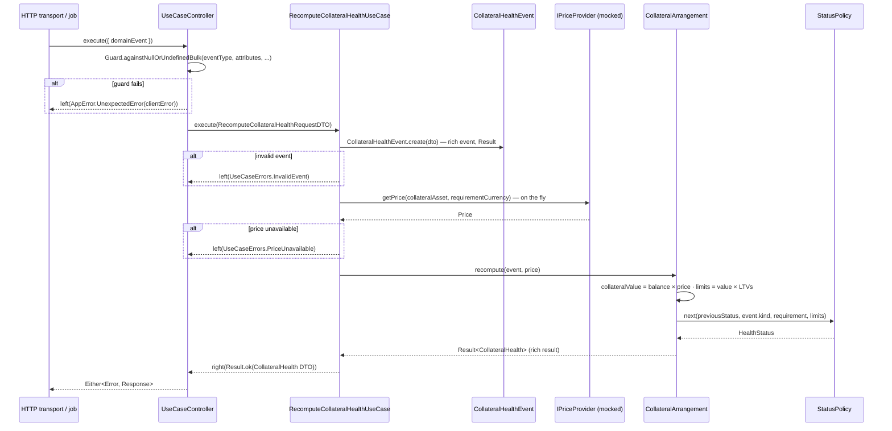

# Collateral Health — Analysis & Solution Proposal

> Take-home exercise (Collateral Health). This document is the *thinking* deliverable:
> how we read the domain, the questions we found, the decisions we propose, the
> architecture, and the technology. The code deliverable follows the plan below.

---

## 1. What is being asked

We must deliver a **well-modelled library with a clear public API** that computes the
**health status** of a *Collateral Arrangement (CA)* in response to an *event*. No UI,
no HTTP, no persistence are required — but the code must be trivially *consumable* by an
HTTP controller or a background job (price move, repayment, scheduled recompute).

> The prompt is explicit that the evaluation is about **how we think**: how we model the
> domain, what we choose to leave out, how we test, and how legible our reasoning is —
> **not** how much we build. So the domain model and its tests are the star; everything
> around it is a thin, obvious shell.

### 1.1 The domain in one paragraph

A CA holds a **collateral balance** in one asset (e.g. `2 BTC`) and backs a loan with a
**requirement** denominated in another asset (e.g. `USDC`). Using a (mockable) **price**,
the collateral is valued in the requirement's currency:
`collateral value = balance × price`. Three loan-to-value ratios
(`Initial ≤ Maintenance ≤ Liquidation`) each derive a monetary **limit**:
`limit = collateral value × LTV`. The CA's **status** is decided by where the
**requirement** falls relative to those three limits — *plus* history-dependent rules
that depend on the **event** that triggered the recompute and the **previous status**.

### 1.2 The five statuses (by severity)

| # | Status | Meaning |
|---|--------|---------|
| 0 | **Good Standing** | Requirement comfortably below the initial limit. |
| 1 | **Near Margin** | Requirement in `[Initial, Maintenance)` on an ordinary recompute. |
| 2 | **Initial Margin Call** | A call raised **only at link time** when `requirement ≥ Initial`. |
| 3 | **Maintenance Margin Call** | Requirement in `[Maintenance, Liquidation)`. |
| 4 | **Liquidation** | Requirement `≥ Liquidation`. |

### 1.3 The rules, restated precisely

**Base classification** (pure function of `requirement` vs the three limits `I ≤ M ≤ L`).
Evaluated most-severe-first so that when limits are *equal*, the more severe status wins
(the "precedence" rule — *Liquidation > Maintenance > Initial*):

```
requirement ≥ L        → Liquidation
requirement ≥ M        → Maintenance Margin Call
requirement ≥ I        → Near Margin
otherwise (< I)        → Good Standing
```

> **Key observation:** the base classification **never** produces *Initial Margin Call*.
> `Initial Margin Call` is reachable **only through a link event** (rule 5). This is the
> single most important structural insight in the spec.

**Event- and history-dependent rules:**

- **(5) Link event** produces only *Good Standing* or *Initial Margin Call*:
  `requirement ≥ Initial → Initial Margin Call`, else *Good Standing* — **regardless of
  which higher limit is crossed**. *Exception:* a link **must not** override a preexisting
  *Maintenance Margin Call* or *Liquidation* (those are left unchanged).
- **(6)** *Initial Margin Call* **cannot be promoted** to *Maintenance Margin Call* or
  *Liquidation*.
- **(7)** *Maintenance Margin Call* / *Liquidation* **do not return to Good Standing**
  until `requirement < Initial`.
- **(8)** *Maintenance Margin Call* **can be promoted** to *Liquidation*.

---

## 2. The model we propose (the core)

The spec says a status is *(re)computed in response to an event* — so **the input is
modelled as a first-class, rich domain event** (see §2.4), and the computation splits into
a **pure classification** (base bands) and a **stateful transition** (event + previous
status). All of it is pure and independently testable.

### 2.1 Base classification

`baseStatus(requirement, limits) → one of { GoodStanding, NearMargin, MaintenanceMarginCall, Liquidation }`
using the top-down `≥` ladder in §1.3. This alone satisfies the "precedence with equal
LTVs" rule with no special-casing.

### 2.2 Transition function

`next(previous, event, requirement, limits) → HealthStatus`

**Link event** (`I` = initial limit):

| previous | result |
|---|---|
| Maintenance Margin Call | *unchanged* (Maintenance Margin Call) |
| Liquidation | *unchanged* (Liquidation) |
| any other | `requirement ≥ I` → **Initial Margin Call**, else **Good Standing** |

**Ordinary recompute** (price move, balance change, repayment). Let `b = baseStatus(...)`:

| previous | result |
|---|---|
| Good Standing | `b` (may jump to any band, incl. straight to Liquidation) |
| Near Margin | `b` |
| Initial Margin Call | `requirement < I` → **Good Standing**, else **Initial Margin Call** |
| Maintenance Margin Call | `requirement < I` → **Good Standing**; `requirement ≥ L` → **Liquidation**; else **Maintenance Margin Call** |
| Liquidation | `requirement < I` → **Good Standing**, else **Liquidation** |

The unifying principle across rows 3–5: **an open call (Initial / Maintenance /
Liquidation) only "cures" once `requirement < Initial`; while it is open it never demotes
to a *less* severe status** — it either holds or, where allowed, escalates
(Maintenance → Liquidation). This is how we resolve the two genuine ambiguities in the
spec (see Q1 and Q2). *Good Standing* and *Near Margin* are not "calls", so they follow
the base classification freely.

### 2.3 State machine (the whole domain, at a glance)



### 2.4 The input: a rich domain event

The trigger is not a loose string — it is a **domain model in its own right**:
`CollateralHealthEvent`. It is created through a validated `static create(...) → Result`
and captures everything the rules care about:

- **`kind`** — the spec distinguishes exactly two kinds: `Link` (the loan being linked to
  the CA) and `Recompute` (anything else: price move, balance change, repayment). The
  event normalizes concrete trigger types (e.g. `loan.linked`, `price.moved`,
  `loan.repaid`) into these two kinds, so the transition rules stay a closed set.
- **The figures the computation needs** — collateral balance, requirement and the LTV
  schedule, each already promoted to a value object (`Money`, `LtvSchedule`) by the time
  the event exists.

> **The price is deliberately *not* part of the event.** It is volatile market data, not a
> fact of the trigger — the use case resolves it **on the fly** through the
> `IPriceProvider` port at compute time (decision noted in Q5).

An invalid trigger (unknown kind, missing figures, mixed currencies) **fails at event
construction** — the rules engine never sees malformed input.

### 2.5 The output: a rich domain result

The computation does not return a bare enum. It returns **`CollateralHealth`** — a rich
domain entity following the "rich entity that derives computed fields at construction"
pattern: constructed through a guarded
`static create(...) → Result<CollateralHealth>`, it holds the new `HealthStatus`, the
previous status, the event kind, the collateral value and the three `MarginLimits`, and
**derives** its computed fields at construction time via private setters — e.g.
`utilization` (requirement ÷ collateral value) and `headroomToLiquidation`
(liquidation limit − requirement). Consumers (controllers, jobs) get everything they need
from getters without re-deriving anything.

---

## 3. Open questions & the decisions we propose

Per the brief: where a rule is incomplete/ambiguous/contradictory, **decide, document, and
move on**. Each of these is encoded as an explicit, named test case.

**Q1 — What happens to an *Initial Margin Call* on an ordinary recompute when the
requirement falls back into the *Near Margin* band `[Initial, Maintenance)`?**
The spec says IMC "cannot be *promoted*" (rule 6) but is silent on de-escalation.
→ **Decision: it stays *Initial Margin Call* while `requirement ≥ Initial`, and cures to
*Good Standing* only when `requirement < Initial`.** Rationale: a margin call is an open
obligation; reporting "Near Margin" (a *less*-severe "approaching" state) while the
requirement is still *at/above* the initial limit would misrepresent an open call. This is
also symmetric with rule 7. *Alternative rejected:* clamp-promotion-only, which would let
IMC demote to Near Margin — literal but semantically odd.

**Q2 — Can *Liquidation* partially de-escalate to *Maintenance Margin Call* if the price
recovers (requirement drops below the liquidation limit but stays `≥ Initial`)?**
Rule 7 only forbids returning to *Good Standing* before `requirement < Initial`.
→ **Decision: *Liquidation* is sticky — it holds until `requirement < Initial`, then cures
to *Good Standing*; it does not step down to Maintenance Margin Call.** Rationale:
liquidation is the terminal operational state; a minor price recovery shouldn't silently
downgrade it. *Alternative documented:* band-wise de-escalation (`LIQ → MMC`), which we can
switch to by changing one row of the transition table if the business prefers it.

**Q3 — Can a healthy CA jump straight to *Maintenance Margin Call* / *Liquidation* on an
ordinary recompute, skipping *Initial Margin Call*?**
→ **Yes.** The base classification never yields IMC and no rule mandates gradual
escalation; IMC is a link-time-only concept. A sharp price crash liquidates directly.

**Q4 — Boundary/inequality semantics.** "below" vs "at or above".
→ **Strict `<` for "below", `≥` for "at or above".** Landing *exactly* on a limit belongs
to the more-severe side. Encoded as explicit boundary tests at each threshold.

**Q5 — Where does valuation come from, and in which currency?**
→ `collateral value = balance × price`, expressed **in the requirement's currency**.
**Decision: the price does *not* travel inside the input event — it is calculated on the
fly inside the use case**, through an `IPriceProvider` **port**
(`getPrice(base, quote) → Price`) injected into the use-case factory. The spec's "you may
mock any prices you need" is honored by a `MockPriceProvider` adapter; a real market-data
feed is a drop-in implementation of the same port. Rationale: a price is a *current
observation*, not a fact of the trigger — resolving it at compute time guarantees every
recompute values the collateral with the quote of that moment, and keeps events small,
stable and replayable. `Money` arithmetic is currency-checked so BTC and USDC can never be
mixed by accident.

**Q6 — Monetary precision / rounding.**
→ Represent money with integer minor units / `bigint` (no floats), and **compare limits at
full precision without pre-rounding**. Rounding only ever happens at the presentation edge.

**Q7 — Initial status of a freshly-constructed CA (before any event)?**
→ A CA has **no status until its first event**. In practice the first event is the *link*,
which ignores the previous status unless it is MMC/Liquidation — so an "unset" previous is
safe. We model status as the *last computed* status.

**Q8 — Must `Initial ≤ Maintenance ≤ Liquidation` be enforced?**
→ **Yes**, as an invariant of an `LtvSchedule` value object (returns a failing `Result`
otherwise). Equality between LTVs is allowed (the precedence rule exists precisely for
that case).

---

## 4. Architecture — Onion + DDD

Dependencies point **inwards**: domain knows nothing about application or any framework.
This is what makes the domain unit-testable in isolation and lets the same core be driven
by an HTTP transport *or* a background job without change.

The flow is **Controller → DTO → UseCase → rich domain**: the controller validates the raw
input and shapes it into a Request DTO; the use case orchestrates and handles failures as
typed errors; the domain holds every rule.

### 4.1 Architectural patterns we follow

We lean on three well-established onion/DDD patterns:

| Piece | Pattern | What it gives us |
|---|---|---|
| **Controller** | A **transport-agnostic base-controller** pattern | Extends `BaseController`; receives `{ domainEvent }`; validates with `Guard.againstNullOrUndefinedBulk`; on guard failure returns `left(AppError.UnexpectedError.create(this.clientError(...)))`; otherwise builds the `RequestDTO` and delegates to `useCase.execute(request)`. |
| **UseCase** | A **factory-function use case returning `{ execute }`** | `RecomputeCollateralHealthUseCase(priceProvider: IPriceProvider): UseCase<RequestDTO, Promise<Response>>` — dependencies injected as arguments. Response type is `Either<AppError.UnexpectedError \| <typed use-case errors>, Result<T>>`. Business failures return `left(new <UseCaseErrors.X>())`; unexpected ones are caught in `try/catch` and returned as `left(new AppError.UnexpectedError(err))`. |
| **Rich domain result** | A **rich entity that derives computed fields at construction** | An `Entity` with a guarded `static create(...) → Result`, **derived fields computed at construction** via private setters, and getters exposing value objects. Our `CollateralHealth` (§2.5) follows this shape. |

### 4.2 Layers



### 4.3 Proposed folder layout

```
src/
  shared/                      # shared kernel (framework-agnostic DDD building blocks)
    core/    Result · Either · Guard · UseCase · UseCaseError · AppError · BaseController
    domain/  Entity · AggregateRoot · ValueObject · UniqueEntityID
  contexts/
    collateral/
      domain/
        Money.ts                     Money.test.ts
        Currency.ts
        Price.ts                     Price.test.ts
        Ltv.ts                       Ltv.test.ts
        LtvSchedule.ts               LtvSchedule.test.ts        # enforces I ≤ M ≤ L
        MarginLimits.ts              MarginLimits.test.ts       # value × LTV → 3 limits
        HealthStatus.ts              HealthStatus.test.ts       # enum + severity ordering
        CollateralHealthEvent.ts     CollateralHealthEvent.test.ts  # rich input event (§2.4)
        StatusPolicy.ts              StatusPolicy.test.ts       # ← THE CORE RULES
        CollateralArrangement.ts     CollateralArrangement.test.ts
        CollateralHealth.ts          CollateralHealth.test.ts   # rich result (§2.5)
        IPriceProvider.ts                                       # port — price on the fly (Q5)
      application/
        recomputeCollateralHealth/
          RecomputeCollateralHealthUseCase.ts            + .test.ts
          RecomputeCollateralHealthUseCaseController.ts  + .test.ts
          RecomputeCollateralHealthUseCaseErrors.ts
      infra/
        pricing/
          MockPriceProvider.ts       MockPriceProvider.test.ts  # mock quotes, per the spec
      tests/
        CollateralArrangementMother.ts   # Object Mothers for valid domain objects
        CollateralHealthEventMother.ts
```

> **Every domain model owns its test file** — the explicit requirement of this challenge.
> `StatusPolicy.test.ts` and `CollateralArrangement.test.ts` are where the money is — they
> encode the base bands, the precedence rule, all eight event/history rules, the boundary
> cases, and the worked example verbatim. The **controller** and the **use case** each have
> their own unit test too (§6).

### 4.4 Information flow



**Failure handling in the use case** (same manner as `UpdateMemberRoleUseCase`): each
business failure is a dedicated class in `RecomputeCollateralHealthUseCaseErrors`
(e.g. `InvalidEvent`, `PriceUnavailable`, `InvalidCollateralArrangement`) returned via
`left(new ...())`; anything unexpected — including a throwing price provider — is caught
by the surrounding `try/catch` and surfaced as `left(new AppError.UnexpectedError(err))`.
Consumers pattern-match on the `Either` — no exceptions cross the boundary.

---

## 5. Technology

**Decision: Node.js + TypeScript, tested with Jest.** (Other options considered for this
challenge — React, NestJS — were dropped: no UI is in scope, and no framework is needed
for a library whose controller is already transport-agnostic.)

| Choice | Role | Why |
|---|---|---|
| **TypeScript** (strict) | Language | Value objects + `Result`/`Either` make invariant violations *values, not exceptions*. Matches "we are a TypeScript shop". |
| **Node.js** (LTS) | Runtime | The deliverable is a Node-consumable library; no browser concern. |
| **Jest + ts-jest** | Testing | Enables true TDD (red → green → refactor) with one `*.test.ts` per unit — domain models, use case, and controller alike. |

---

## 6. Development approach (TDD, in order)

We write tests first, one concept at a time, inside-out. **Every domain model gets its own
unit test file exercising its logic**, and the use case and controller each get theirs:

1. **`Money` / `Price`** — construction, currency-safety, `balance × price` valuation.
2. **`Ltv` / `LtvSchedule`** — percentage validity; the `I ≤ M ≤ L` invariant (incl. equality).
3. **`MarginLimits`** — `value × LTV` for all three; reproduce the worked-example limits
   (`30k / 39k / 48k`).
4. **`CollateralHealthEvent`** — rich input event: valid kinds (`Link` / `Recompute`),
   normalization of concrete trigger types, rejection of unknown kinds and malformed figures.
5. **`StatusPolicy` (base + transition)** — the heart. Table-driven tests over: every base
   band; the precedence rule with equal LTVs; all eight event/history rules; each threshold
   boundary (`<` vs `≥`); the two ambiguities (Q1, Q2); the worked example (both the ordinary
   `→ Maintenance Margin Call` and the link `→ Initial Margin Call` outcomes).
6. **`CollateralArrangement`** — the aggregate wires balance + requirement + schedule +
   status and exposes `recompute(event)`; tests confirm state is mutated correctly and the
   previous status is respected.
7. **`CollateralHealth`** — the rich result: guarded `create`, derived fields (utilization,
   headroom) computed at construction, getters exposing VOs.
8. **`RecomputeCollateralHealthUseCase`** — unit test with a **stubbed `IPriceProvider`**
   (the price is resolved on the fly inside the use case — Q5): happy path returns
   `right(Result.ok(...))` valuing the collateral with the stubbed quote; each typed error
   path returns the matching `left` (incl. `PriceUnavailable`); a throwing provider
   surfaces as `left(AppError.UnexpectedError)`.
   Then **`MockPriceProvider`** — the infra adapter with configurable mock quotes.
9. **`RecomputeCollateralHealthUseCaseController`** — unit test with a mocked use case:
   missing/`undefined` event fields fail the guard and return the client error **without
   invoking the use case**; valid raw input builds the exact expected `RequestDTO` and
   passes the use-case response through untouched.

---

## 7. Deliberately out of scope (and what we'd do next)

- **Persistence / repositories** — the challenge computes health from the event's figures;
  no storage is required. Adding one later is a port + adapter, invisible to the domain.
- **A real price feed** — the price is resolved on the fly through `IPriceProvider` (Q5);
  the delivered adapter is `MockPriceProvider`. A live market-data client is a drop-in
  implementation of the same port, with no change to the use case or domain.
- **A real HTTP transport** — the `BaseController`-style controller is transport-agnostic;
  wiring Express/Fastify (or a queue consumer) around it is mechanical.
- **Domain events / audit trail** — a real system would emit `HealthRecomputed` /
  `MarginCallRaised` events for downstream jobs; the aggregate is the natural emitter.
- **Multi-asset / partial liquidation mechanics** — the spec models a single collateral
  asset and a single requirement; we honor that.
- **Time & price staleness** — no timestamps in the spec; a production version would carry
  price/observation timestamps and a staleness policy.
- **Observability** — a production version would wrap unexpected errors with structured
  wide-event logging; here we keep the `try/catch → AppError.UnexpectedError` shape and
  leave structured logging as a drop-in.
